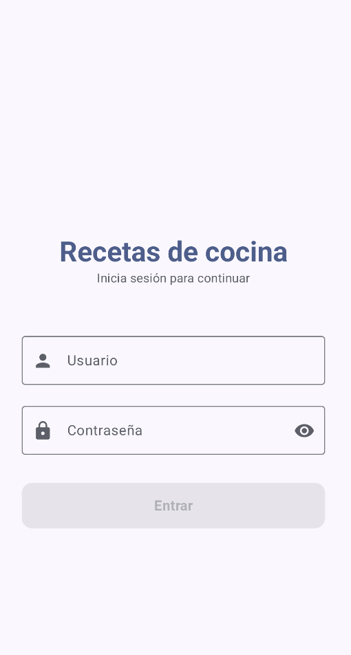
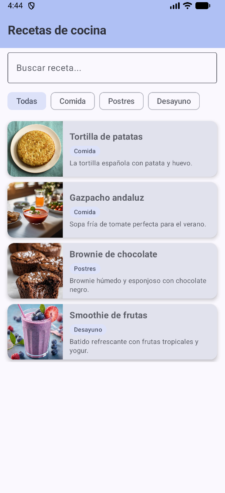
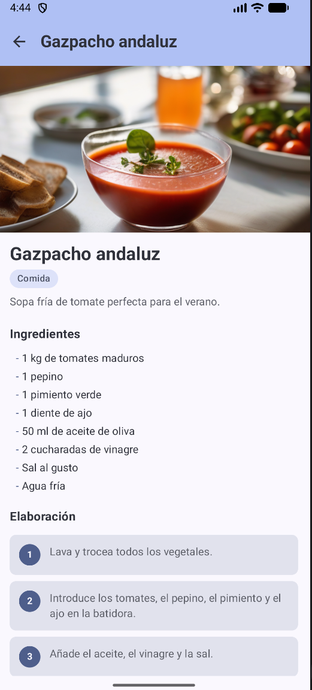

# App de Recetas Kotlin MVVM

Aplicación móvil desarrollada en Kotlin orientada a la gestión y visualización de recetas culinarias, implementando arquitectura MVVM y navegación entre pantallas.

## Características

* Sistema de login de usuario
* Listado de recetas
* Visualización detallada de cada receta
* Filtrado y navegación entre recetas
* Interfaz desarrollada con Android Studio
* Separación de capas mediante arquitectura MVVM

## Tecnologías utilizadas

* Kotlin
* Android Studio
* Arquitectura MVVM
* ViewModel
* Navigation Component
* Jetpack Compose
* Git y GitHub

## Estructura del proyecto

* `model` → gestión de datos y recetas
* `view` → pantallas de la aplicación
* `viewmodel` → lógica y comunicación entre vista y datos
* `navigation` → control de navegación entre pantallas

## Objetivo del proyecto

Desarrollar una aplicación móvil aplicando buenas prácticas de arquitectura de software, navegación entre pantallas y organización del código mediante el patrón MVVM.

## Capturas
### Pantalla de Login

### Lista de recetas

### Detalle de receta

